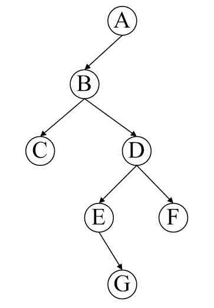

场景描述：

> 输入一个二叉树的前序遍历、中序遍历的结果，重建该二叉树。假设前序遍历、中序遍历的结果中，都不含重复的数字。

## 遍历

一个二叉树，有如下几种遍历结果：

* 前序遍历：先根节点，再左子节点，后右子节点*（中左右）*
* 中序遍历：先左子节点，再根节点，后右子节点*（左中右）*
* 后序遍历：先左子节点，再右子节点，后根节点*（左右中）*

以下图为例，每种遍历结果如下：

* 先序：ABCDEGF
* 中序：CBEGDFA
* 后序：CGEFDBA

## 基础知识

二叉树，每个结点最多有两棵子树，左子树和右子树，次序不可以颠倒。

性质：

1. 非空二叉树的第n层上至多有`2^(n-1)`个元素。
1. 深度为 `h` 的二叉树至多有`2^h-1`个结点。

**满二叉树**：

* 满二叉树：所有终端都在同一层次，且非终端结点的度数为2。
* 在满二叉树中若其深度为 `h`，则其所包含的结点数必为`2^h-1`。

**完全二叉树**：

* 完全二叉树：除了最大的层次即成为一颗满二叉树且层次最大那层所有的结点均向左靠齐，即集中在左面的位置上，不能有空位置。
* 对于完全二叉树，设一个结点为`i`则其父节点为`i/2`（向下取整），`2i`为左子节点，`2i+1`为右子节点。*（根节点编号为 1）*

tips：

> C 语言中 `typedef` 用于为复杂的声明定义简单的别名。

思考：二叉树，度为 0 的节点个数`n0`、度为 1 的节点个数`n1`、度为 2 的节点个数`n2`，他们之间的关系如何？*（节点的度，表示节点的出度，即，有几个子节点）*

记，二叉树的所有节点个数为`n`，几个等式关系：

* 节点个数：节点总数 = 几类节点个数之和
* 节点个数与数值个数：节点总数 = 树枝总数 + 1 *（因为每个节点都有一个入度，除了根节点）*

具体：

* `n = n0 + n1 + n2`
* `n -1 = n1 + 2 x n2`

能够推出`n0 = n2 + 1`

已知中序遍历和前序遍历，能够求出后续遍历；已知两种遍历，其中，需要包含中序遍历，才能求出第三种遍历；如果只包含前序遍历、后序遍历，无法确定中序遍历。（有重复元素时，会出乱）

##编程

节点定义如下：

	struct BinaryTreeNode
	{
		int m_nValue;
		BinaryTreeNode* m_pLeft;
		BinaryTreeNode* m_pRight;
	};

###1. 求二叉树中的节点个数

递归解法：

1. 如果二叉树为空，节点个数为0
1. 如果二叉树不为空，二叉树节点个数 = 左子树节点个数 + 右子树节点个数 + 1

参考代码如下：

	int GetNodeNum(BinaryTreeNode * pRoot)  
	{  
		if(pRoot == NULL) // 递归出口  
			return 0;  
		return GetNodeNum(pRoot->m_pLeft) + GetNodeNum(pRoot->m_pRight) + 1;  
	}  

###2. 求二叉树的深度

递归解法：

1. 如果二叉树为空，二叉树的深度为0
1. 如果二叉树不为空，二叉树的深度 = max(左子树深度， 右子树深度) + 1

参考代码如下：

	int GetDepth(BinaryTreeNode * pRoot)  
	{  
		if(pRoot == NULL) // 递归出口  
			return 0;  
		int depthLeft = GetDepth(pRoot->m_pLeft);  
		int depthRight = GetDepth(pRoot->m_pRight);  
		return depthLeft > depthRight ? (depthLeft + 1) : (depthRight + 1);   
	}  

###3. 前序遍历，中序遍历，后序遍历

前序遍历递归解法：

1. 如果二叉树为空，空操作
1. 如果二叉树不为空，访问根节点，前序遍历左子树，前序遍历右子树

参考代码如下：

	void Traverse(BinaryTreeNode * pRoot)
	{
		if(pRoot == NULL)
			return;
		Visit(pRoot); // 访问根节点
		Traverse(pRoot->m_pLeft); // 前序遍历左子树
		Traverse(pRoot->m_pRight); // 前序遍历右子树
	}

上述是前序遍历方法，中序遍历、后序遍历，只需移动`Visit(pRoot)`的位置即可。

二叉树的非递归实现：

###4. 求二叉树第K层的节点个数

递归解法：

1. 如果二叉树为空或者k<1返回0
1. 如果二叉树不为空并且k==1，返回1
1. 如果二叉树不为空且k>1，返回左子树中k-1层的节点个数与右子树k-1层节点个数之和

参考代码如下：

	int GetNodeNumKthLevel(BinaryTreeNode * pRoot, int k)  
	{  
		if(pRoot == NULL || k < 1)  
			return 0;  
		if(k == 1)  
			return 1;  
		int numLeft = GetNodeNumKthLevel(pRoot->m_pLeft, k-1); // 左子树中k-1层的节点个数  
		int numRight = GetNodeNumKthLevel(pRoot->m_pRight, k-1); // 右子树中k-1层的节点个数  
		return (numLeft + numRight);  
	}  

###5. 求二叉树中叶子节点的个数

递归解法：

1. 如果二叉树为空，返回0
1. 如果二叉树不为空且左右子树为空，返回1
1. 如果二叉树不为空，且左右子树不同时为空，返回左子树中叶子节点个数加上右子树中叶子节点个数

参考代码如下：

	int GetLeafNodeNum(BinaryTreeNode * pRoot)  
	{  
		if(pRoot == NULL)  
			return 0;  
		if(pRoot->m_pLeft == NULL && pRoot->m_pRight == NULL)  
			return 1;  
		int numLeft = GetLeafNodeNum(pRoot->m_pLeft); // 左子树中叶节点的个数  
		int numRight = GetLeafNodeNum(pRoot->m_pRight); // 右子树中叶节点的个数  
		return (numLeft + numRight);  
	}  

###6. 求二叉树中两个节点的最低公共祖先节点

递归解法：

1. 如果两个节点分别在根节点的左子树和右子树，则返回根节点
1. 如果两个节点都在左子树，则递归处理左子树；如果两个节点都在右子树，则递归处理右子树

参考代码如下：
	  
	BinaryTreeNode * GetLastCommonParent(BinaryTreeNode * pRoot,   
										 BinaryTreeNode * pNode1,   
										 BinaryTreeNode * pNode2)  
	{  
		if(FindNode(pRoot->m_pLeft, pNode1))  
		{  
			if(FindNode(pRoot->m_pRight, pNode2))  
				return pRoot;  
			else  
				return GetLastCommonParent(pRoot->m_pLeft, pNode1, pNode2);  
		}  
		else  
		{  
			if(FindNode(pRoot->m_pLeft, pNode2))  
				return pRoot;  
			else  
				return GetLastCommonParent(pRoot->m_pRight, pNode1, pNode2);  
		}  
	}  

	bool FindNode(BinaryTreeNode * pRoot, BinaryTreeNode * pNode)  
	{  
		if(pRoot == NULL || pNode == NULL)  
			return false;  
	  
		if(pRoot == pNode)  
			return true;  
	  
		bool found = FindNode(pRoot->m_pLeft, pNode);  
		if(!found)  
			found = FindNode(pRoot->m_pRight, pNode);  
	  
		return found;  
	}  

非递归解法：

先求从根节点到两个节点的路径，然后再比较对应路径的节点就行，最后一个相同的节点也就是他们在二叉树中的最低公共祖先节点

###7. 判断两棵二叉树是否结构相同

不考虑数据内容。结构相同意味着对应的左子树和对应的右子树都结构相同。

递归解法：

1. 如果两棵二叉树都为空，返回真
1. 如果两棵二叉树一棵为空，另一棵不为空，返回假
1. 如果两棵二叉树都不为空：
	1. 判断节点取值是否相同，若不相同，则返回假
	1. 若节点取值相同，则判断对应的左子树和右子树都同构返回真，其他返回假

参考代码如下：

	bool StructureCmp(BinaryTreeNode * pRoot1, BinaryTreeNode * pRoot2)  
	{  
		if(pRoot1 == NULL && pRoot2 == NULL) // 都为空，返回真  
			return true;  
		else if(pRoot1 == NULL || pRoot2 == NULL) // 有一个为空，一个不为空，返回假  
			return false;  
			
		bool result = (pRoot1->value == pRoot2->value);
		if(result){
			bool resultLeft = StructureCmp(pRoot1->m_pLeft, pRoot2->m_pLeft); // 比较对应左子树   
			bool resultRight = StructureCmp(pRoot1->m_pRight, pRoot2->m_pRight); // 比较对应右子树  
			result = (resultLeft && resultRight);
		}
		return result;  
	}   

注：上述代码可做调整：

	bool StructureCmp(BinaryTreeNode * pRoot1, BinaryTreeNode * pRoot2)  
	{  
		if(pRoot1 == NULL && pRoot2 == NULL) // 都为空，返回真  
			return true;  
		else if(pRoot1 == NULL || pRoot2 == NULL) // 有一个为空，一个不为空，返回假  
			return false;  

		if(pRoot1->value == pRoot2->value){
			if(StructureCmp(pRoot1->m_pLeft, pRoot2->m_pLeft)){ // 比较对应左子树   
				if(StructureCmp(pRoot1->m_pRight, pRoot2->m_pRight)) // 比较对应右子树  
					return true;
			} 
		}
		return false;  
	}   

###8. 树的子结构

> 输入两棵二叉树A和B，判断B是不是A的子结构。

分为几点：遍历二叉树、判断两个二叉树是否相等；

	//判断B是否为A的子结构(遍历二叉树)
	bool IsSubStruct(BinaryTreeNode * pRootOfTreeA, BinaryTreeNode * pRootOfTreeB)  
	{  
	   
	   if(pRootOfTreeB == null)
	      return true;
	   
	   if(pRootOfTreeA == null)
	      return false;

	   bool result = false;  

	   if (pRootOfTreeA->m_nValue == pRootOfTreeB->m_nValue)  
		   result = DoesTree1haveTree2(pRootOfTreeA, pRootOfTreeB);  
  
	   if (!result)  
		   result = IsSubStruct(pRootOfTreeA->m_pLeft, pRootOfTreeB);  
  
	   if (!result)  
		   result = IsSubStruct(pRootOfTreeA->m_pRight, pRootOfTreeB);  
	  
	   return result;  
	}  

	// 判断两个二叉树,是否相等
	bool DoesTree1haveTree2(BinaryTreeNode * pRoot1, BinaryTreeNode * pRoot2)  
	{  
		if (pRoot2 == NULL)  
			return true;  
	  
		if (pRoot1 == NULL)  
			return false;  
	  
		if (pRoot1->m_nValue != pRoot2->m_nValue)  
			return false;  
	  
		return DoesTree1haveTree2(pRoot1->m_pLeft, pRoot2->m_pLeft)  
			&& DoesTree1haveTree2(pRoot1->m_pRight, pRoot2->m_pRight);  
	}  

###9. 二叉树的镜像

几点：

* 画图分析思路
* 注意边界条件

示例代码如下：

	Node* invertTree(Node* pRoot)
	{
		if(pRoot == null)
		   return pRoot;

		Node* pTemp = invertTree(pRoot->left);
		pRoot->left = invertTree(pRoot->right);
		pRoot->right = pTemp;

		return pRoot;
	}

###10. 层次遍历二叉树

借用队列来实现，每输出一个节点，就将其子节点送入队列：

	void LevelTraverse(BinaryTreeNode * pRoot)  
	{  
		if(pRoot == NULL)  
			return;  

		queue<BinaryTreeNode *> q;  
		q.push(pRoot);  

		while(!q.empty())  
		{  
			BinaryTreeNode * pNode = q.front();  
			q.pop();  
			Visit(pNode); // 访问节点  
			if(pNode->m_pLeft != NULL)  
				q.push(pNode->m_pLeft);  
			if(pNode->m_pRight != NULL)  
				q.push(pNode->m_pRight);  
		}  
		return;  
	}  

更多参考：

* [ 数据结构（六）——二叉树 前序、中序、后序、层次遍历及非递归实现 查找、统计个数、比较、求深度的递归实现][ 数据结构（六）——二叉树 前序、中序、后序、层次遍历及非递归实现 查找、统计个数、比较、求深度的递归实现]

##参考来源

* [ 数据结构（六）——二叉树 前序、中序、后序、层次遍历及非递归实现 查找、统计个数、比较、求深度的递归实现][ 数据结构（六）——二叉树 前序、中序、后序、层次遍历及非递归实现 查找、统计个数、比较、求深度的递归实现]
* [C 语言中 typedef][C 语言中 typedef]
* [轻松搞定面试中的二叉树题目][轻松搞定面试中的二叉树题目]
* [二叉树二度节点和叶子节点的数量关系][二叉树二度节点和叶子节点的数量关系]
* [面试题16：树的子结构][面试题16：树的子结构]

[NingG]:    http://ningg.github.com  "NingG"

[ 数据结构（六）——二叉树 前序、中序、后序、层次遍历及非递归实现 查找、统计个数、比较、求深度的递归实现]:		http://blog.csdn.net/fansongy/article/details/6798278
[C 语言中 typedef]:							http://baike.baidu.com/view/1283800.htm
[轻松搞定面试中的二叉树题目]:				http://blog.csdn.net/luckyxiaoqiang/article/details/7518888
[二叉树二度节点和叶子节点的数量关系]:		http://blog.csdn.net/lizhi389/article/details/8214427
[面试题16：树的子结构]:						http://blog.csdn.net/htyurencaotang/article/details/9398929

