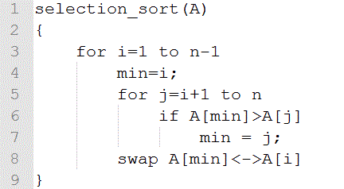
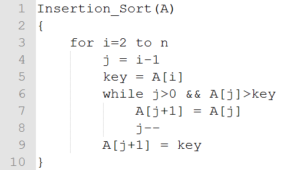
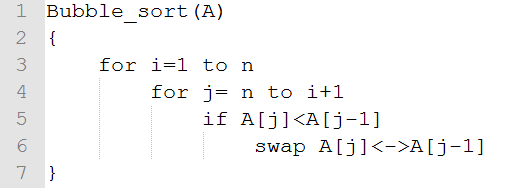
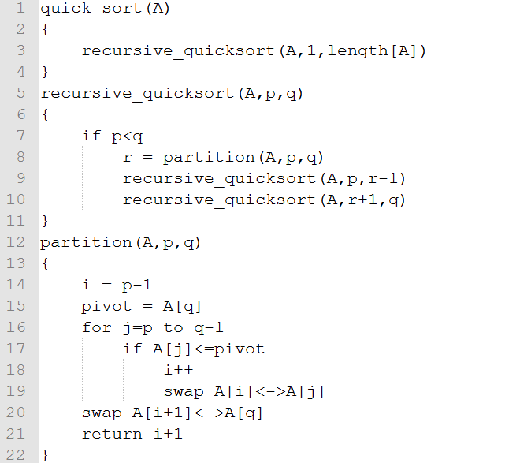
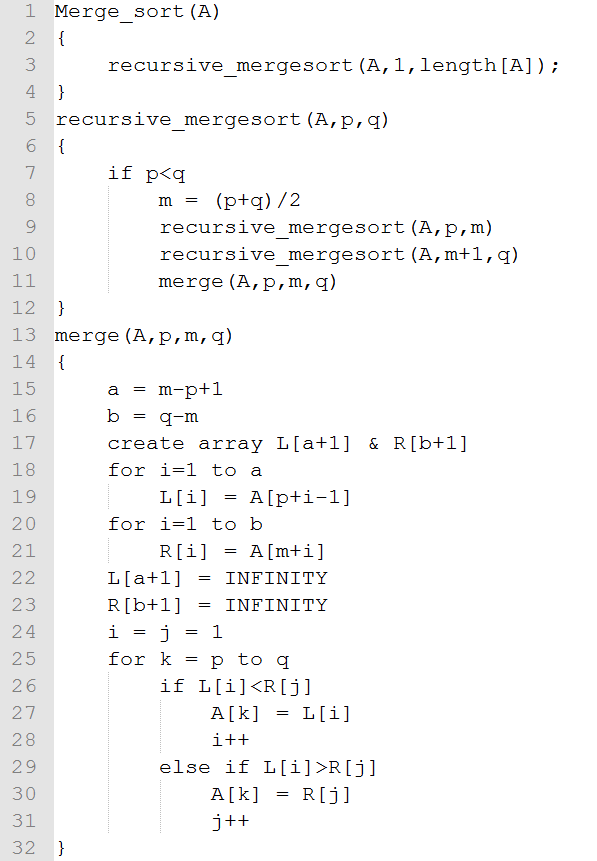
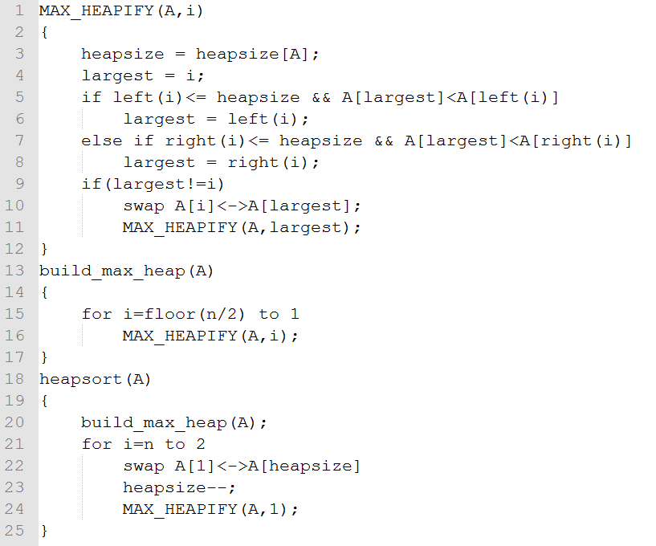

几点：

* 归并排序
* 快排

##排序算法对比

几种排序算法：

* 选择排序
* 插入排序
* 冒泡排序
* 归并排序
* 快速排序

他们在空间复杂度、平均时间复杂度、最差时间复杂度上的差异？

###排序的基本思路（选择排序）

基本原理：首先在未排序序列中找到最小元素，存放到排序序列的起始位置，然后，再从剩余未排序元素中继续寻找最小元素，然后放到排序序列末尾。以此类推，直到所有元素均排序完毕。；具体过程：

1. 每次从数组中选择一个最小的数字；
1. 递归上述步骤；

时间复杂度：`O(n^2)`，其实就是选择排序

最优时间：`O(n^2)`，最差时间：`O(n^2)`

###插入排序

基本思路：构建有序序列，对于未排序数据，在已排序序列中从后向前扫描，找到相应位置并插入。具体过程如下：

1. 从第一个元素开始，该元素可以认为已经被排序
1. 取出下一个元素，在已经排序的元素序列中从后向前扫描
1. 如果该元素（已排序）大于新元素，将该元素移到下一位置
1. 重复步骤3，直到找到已排序的元素小于或者等于新元素的位置
1. 将新元素插入到该位置中
1. 重复步骤2

最优时间：`O(n^2)`，最差时间：`O(n^2)`

###冒泡排序

基本思路，相邻的两个元素进行比较，将较大的元素后移，一次遍历，能够得到最大的元素，递归下去；具体过程：

1. 比较相邻的元素。如果第一个比第二个大，就交换他们两个。
1. 对每一对相邻元素作同样的工作，从开始第一对到结尾的最后一对。在这一点，最后的元素应该会是最大的数。
1. 针对所有的元素重复以上的步骤，除了最后一个。
1. 持续每次对越来越少的元素重复上面的步骤，直到没有任何一对数字需要比较。

最优时间：`O(n^2)`，最差时间：`O(n^2)`

###快速排序

基本过程：

1. 从数列中挑出一个元素，称为 `基准`（pivot），
1. 重新排序数列，所有元素比`基准`值小的摆放在`基准`前面，所有元素比`基准`值大的摆在`基准`的后面（相同的数可以到任一边）。在这个分区退出之后，该`基准`就处于数列的中间位置。这个称为分区（partition）操作。
1. 递归地（recursive）把小于基准值元素的子数列和大于基准值元素的子数列排序。

上述算法的基本思路是：分治思想，递归分为两个分区，则，时间复杂度为`O(n*log(n))`；对于已经排序好的数组，此时，快排算法的时间复杂度最差，为`O(n^2)`；特别说明，快排算法的一个关键点是如何选取`基准`，巧妙的设计能够降低时间复杂度的细数。

###归并算法

归并算法（Merge sort），基本思路是分治思想，基本过程：

1. 申请空间，使其大小为两个已经排序序列之和，该空间用来存放合并后的序列
1. 设定两个指针，最初位置分别为两个已经排序序列的起始位置
1. 比较两个指针所指向的元素，选择相对小的元素放入到合并空间，并移动指针到下一位置
1. 重复步骤3直到某一指针达到序列尾
1. 将另一序列剩下的所有元素直接复制到合并序列尾

最优时间：`O(nlgn)`，最差时间：`O(nlgn)`

###堆排序

思想：运用了最小堆、最大堆这个数据结构，而堆还能用于构建优先队列。

* 优先队列应用于进程间调度、任务调度等。
* 堆数据结构应用于Dijkstra、Prim算法。

最优时间：`O(nlgn)`，最差时间：`O(nlgn)`

###小结

* In-place sort（不占用额外内存或占用常数的内存）：插入排序、选择排序、冒泡排序、堆排序、快速排序。
* Out-place sort：归并排序、计数排序、基数排序、桶排序。

当需要对大量数据进行排序时，In-place sort就显示出优点，因为只需要占用常数的内存。
设想一下，如果要对10000个数据排序，如果使用了Out-place sort，则假设需要用200G的额外空间，则一台老式电脑会吃不消，但是如果使用In-place sort，则不需要花费额外内存。

* stable sort：插入排序、冒泡排序、归并排序、计数排序、基数排序、桶排序。
* unstable sort：选择排序、快速排序、堆排序。

更多参考：

* [九大排序算法再总结][九大排序算法再总结]

##参考来源

* [视觉直观感受的7种常用的排序算法][视觉直观感受的7种常用的排序算法]
* [九大排序算法再总结][九大排序算法再总结]

[NingG]:    http://ningg.github.com  "NingG"

[九大排序算法再总结]:						http://blog.csdn.net/xiazdong/article/details/8462393
[视觉直观感受的7种常用的排序算法]:			http://blog.jobbole.com/11745/

